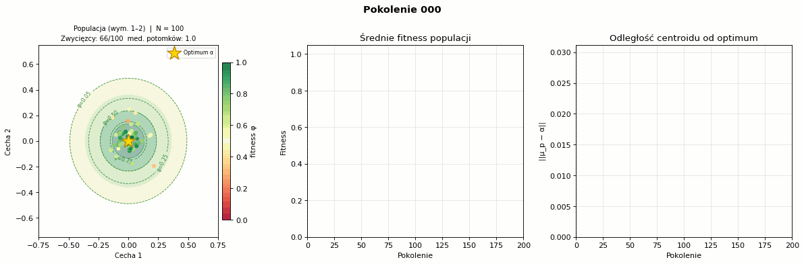

# Modification of Fisher's Geometric Model - flood depiction

Fischer's geometric model assuming asexual cloning, isotropic mutation, and a linearly drifting optimum was modified in order to accomodate for floods. In this model, the environment defines an optimal phenotype $\alpha(t)$ at each generation. Fitness ($\varphi$) is a Gaussian function of phenotypic distance from that optimum. A perfect match gives $\varphi$ = 1; fitness decays exponentially with distance. The width $\sigma$ controls how strict the environment is — smaller $\sigma$ means only near-perfect phenotypes survive.

To read the precise description, view: .pdf

To perform the analysis 20 replicates and 2 different deltas (environmental noise, delta ∈  \{0, 0.01\} for a naive and pre-adapted population:
- run collect_data.py
- run analyze_results.py

The .gif from the analysis:
